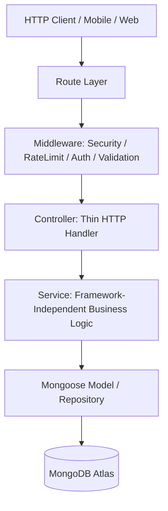

# ISAHARA Backend Architecture (Phase 0 Foundation)

This document describes the architectural foundation for the **ISAHARA** student mobility platform backend.

---

## 1. Architectural Style: Modular Monolith

The backend is organized as a **Modular Monolith**:
- Single deployable Express service running on Render.
- Clean domain boundaries with dedicated modules (`src/modules/<domain>/`).
- High internal cohesion within each domain; loose coupling between domains.
- Shared infrastructure (`config/`, `middleware/`, `shared/`) providing cross-cutting capabilities.

---

## 2. Dependency Flow Principle

All HTTP interactions follow a strict, unidirectional layered flow:



### Layer Responsibilities & Constraints:

1. **Routes (`*.routes.ts`)**:
   - Strictly declarative.
   - Attach middleware (rate limiters, validators, authorization guards).
   - Wire controller methods using `asyncHandler`.
   - **No business logic or queries.**

2. **Middleware (`src/middleware/`)**:
   - `auth.ts`: Session extraction & user identity (Better Auth integration).
   - `authorization.ts`: Permission and role verification (`USER`, `DRIVER_CONDUCTOR`).
   - `validation.ts`: Declarative Zod schema validation for body, query, and params.
   - `rate-limit.ts`: Request volume enforcement.
   - `error.ts`: Centralized error normalization and formatting.

3. **Controllers (`*.controller.ts`)**:
   - Parse and unwrap request inputs (which are already validated by middleware).
   - Invoke domain service methods.
   - Return standardized responses via `sendSuccess` or pass typed errors to Express.
   - **MUST NOT** execute database queries directly.
   - **MUST NOT** contain business rules.

4. **Services (`*.service.ts`)**:
   - Core domain logic and business rule enforcement.
   - Completely framework-independent.
   - **MUST NOT** import or depend on Express `Request`, `Response`, or `NextFunction`.
   - Coordinate with models / repositories for persistence.

5. **Models (`*.model.ts`)**:
   - Define Mongoose schemas, types, and database indexes.
   - Provide persistent storage representations.

---

## 3. Core Domain Concepts & Rules

### Two Application Roles Only:
1. `USER`: Students / passengers searching destinations, discovering active trips, creating ride requests, and tracking rides.
2. `DRIVER_CONDUCTOR`: Combined driver-conductor role creating and activating trips, sharing live GPS, accepting/rejecting ride requests, starting and completing rides.

*There is NO separate DRIVER and CONDUCTOR role.*
*There is NO college-admin role in the core product.*
*There is NO seat inventory or seat capacity reservation system.*

---

## 4. Authentication vs Authorization

- **Authentication ("Who are you?")**:
  - Handled via Better Auth + Google OAuth (Phase 1).
  - Validates session tokens, extracts user identity, and attaches `req.user` to the request context.
- **Authorization ("What are you allowed to do?")**:
  - Enforces role requirements (`requireUser`, `requireDriverConductor`, `requireRole(...)`).
  - Guards admin research endpoints with `requireAdminKey`.

---

## 5. Standardized Response & Error Contracts

### Success Response Contract:
```json
{
  "success": true,
  "data": { ... },
  "message": "Optional descriptive message"
}
```

### Error Response Contract:
```json
{
  "success": false,
  "error": {
    "code": "ERROR_CODE",
    "message": "Human readable message",
    "details": [ ... ]
  }
}
```
*Stack traces and internal database error messages are strictly hidden in production environments.*

---

## 6. Future Architectural Considerations

### A. Trip Architecture (Phase 5)
- Central mobility entity is `Trip`, NOT `Vehicle`.
- A single vehicle executes sequential trips (e.g. BHU → Lanka, then Lanka → Assi).
- `Vehicle` and `Trip` are decoupled models.

### B. Realtime Architecture (Phase 9)
- Normal business transactions (creating trips, requesting rides) use REST APIs with MongoDB as source of truth.
- High-frequency GPS updates and live trip tracking will use WebSocket / Socket.io / SSE.
- Redis can be added later for ephemeral presence, active driver positions, and pub/sub.

### C. Voice-First Mobility (Phase 6)
- Driver voice interactions ("BHU se Lanka jaana hai") will be handled by a dedicated voice service.
- The voice pipeline (STT → Transcript → Entity Extraction → Geocoding → Confirmation) yields a draft trip that the driver explicitly confirms before activation.
- Voice logic will not pollute the core `TripController`.

---

## 7. How to Add a New Module

To add a new domain module (e.g. `trips`):

1. Create directory `src/modules/trips/`.
2. Implement components in order:
   - `trip.types.ts`: Domain types and interfaces.
   - `trip.schema.ts`: Zod validation schemas.
   - `trip.model.ts`: Mongoose schema and model.
   - `trip.service.ts`: Business logic functions.
   - `trip.controller.ts`: Thin HTTP controllers.
   - `trip.routes.ts`: Declarative Express router.
3. Mount the router in `src/routes/index.ts`:
   ```typescript
   import tripRoutes from "../modules/trips/trip.routes";
   apiV1Router.use("/trips", tripRoutes);
   ```
